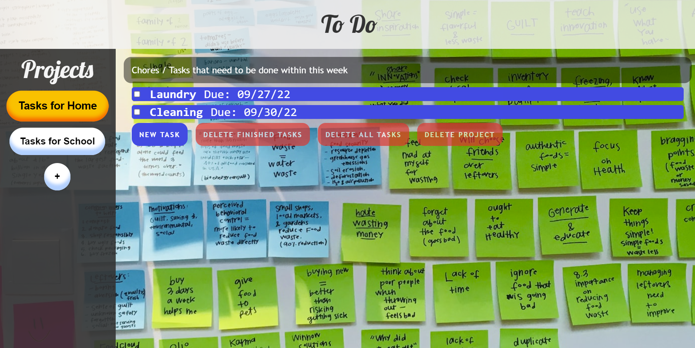
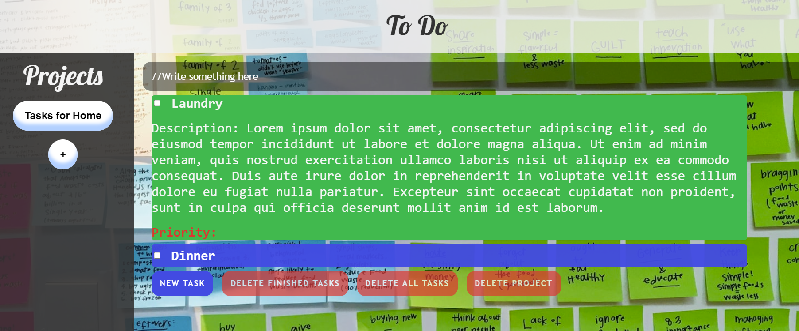

# To-Do List: 
### A fully functional to-do list app in your browser!

<table>
  <td align="center"><b>Made using:</b></td>
  <td> 
    
    
    
    
  </td>
</table>

#### Click on the pictures/the link below to try!

## [Click to open](https://redplusblue.github.io/to-do/)

## Features:
1. Can create custom projects with name and description. 
2. Each project can have tasks, which can have a Name, Description, Due Date, and a priority.
3. Your saved tasks/projects stay even on if the browser closes! (if you have localStorage) 

## What I used/learned:
1. CSS: Animations, Transform, Layout. 
2. JS: Webpack (bundling, dynamic html page creation, development server, `import` , `export`), localStorage, sessionStorage
3. npm, lodash

 

###### An exercise for [TheOdinProject](theodinproject.com)
